## Homework 6 - SofaScore Frontend Academy

The goal of this homework is to create a whole React app based on the existing design.

## React project setup

We will use Create React App, just like in previous homework. [Instructions for CRA initialization in previous homework](https://github.com/MSekrst/sofascore-academy-2020/tree/master/homework/04#react-project-setup).

## Task

Your task is to create a simple TODO list app from the existing design.

You can choose your complexity tier, based on your confidence and available time.

Tiers are:

- 1. Basic - User can add multiple todos, which are then displayed. Users can also click single todo item which marks todo task as complete.
- 2. Intermediate - Everything from the Basic tier with added possibilities to delete todo tasks and to filter todos to show only completed/non-completed or show all todo items.
- 3. Advanced - Create the whole app by design with few constraints. Todos should be stored and modified via React Context. There should be a custom hook for showing/hiding logic which is then reused while showing form and filters.

# Design

When the user opens the app only the header and ADD TODO button are visible.

Desktop:
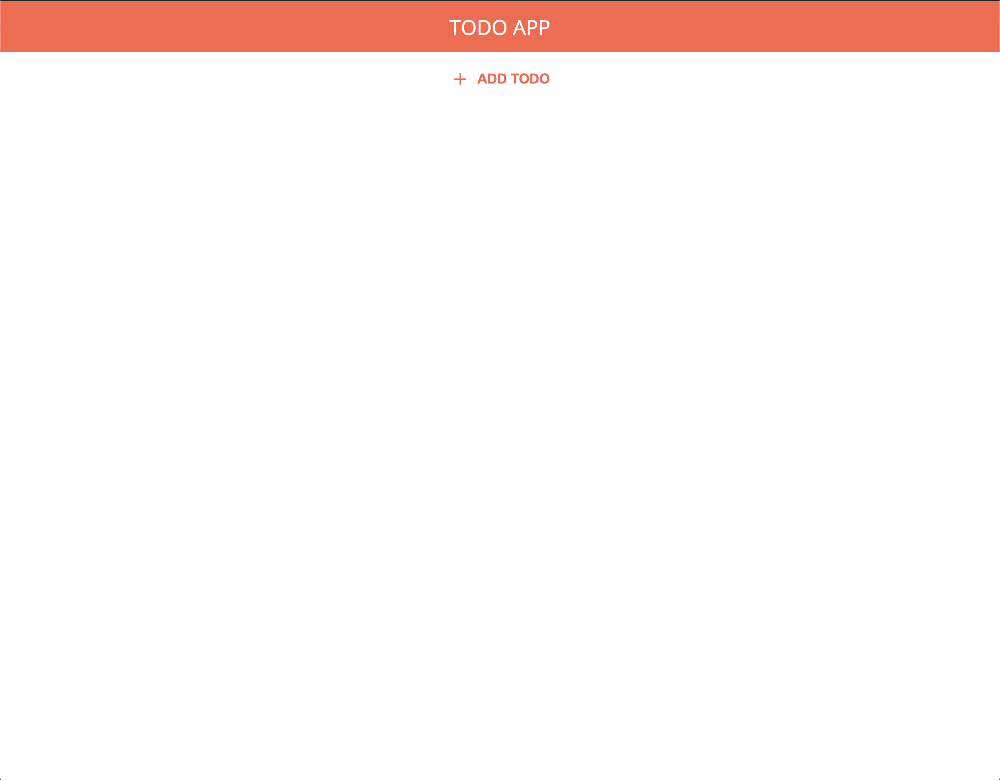

Mobile:
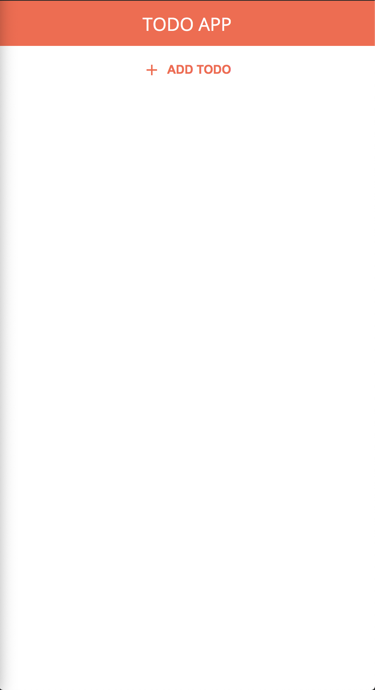

The user then clicks ADD TODO button which on click displays the form with text input and two buttons. One will submit the form when input is not empty and the other will hide the form and reset entered text.

Desktop:
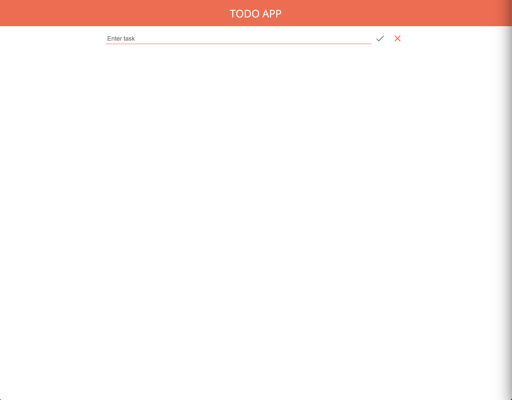

Mobile:
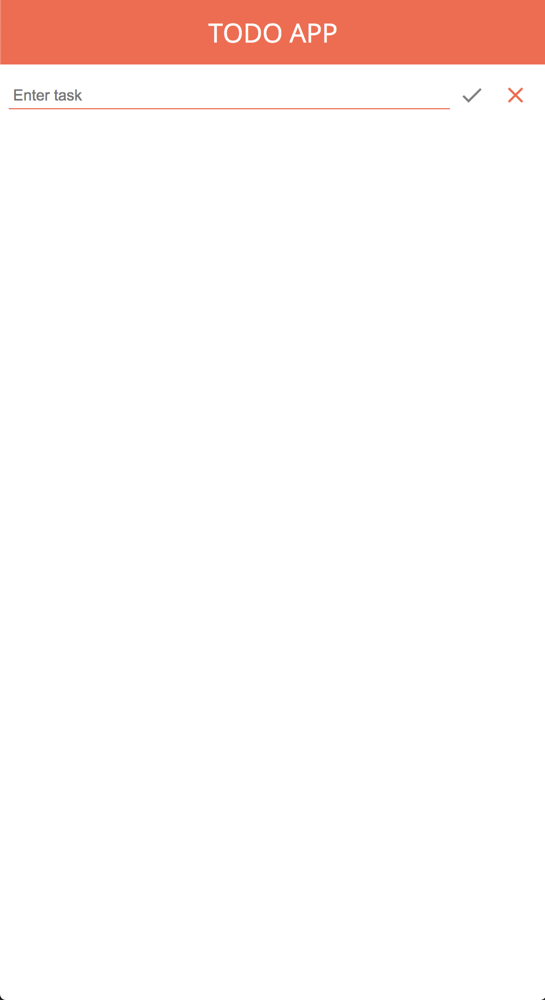

When the user types in some text submit button should be enabled.

Desktop:
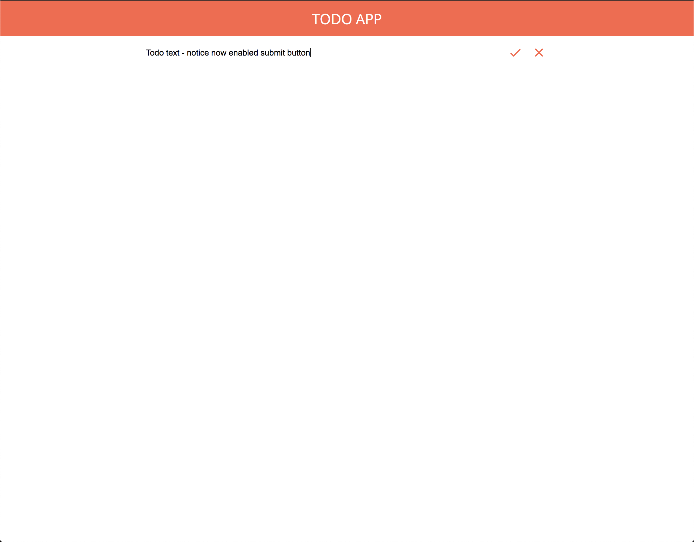

Mobile:
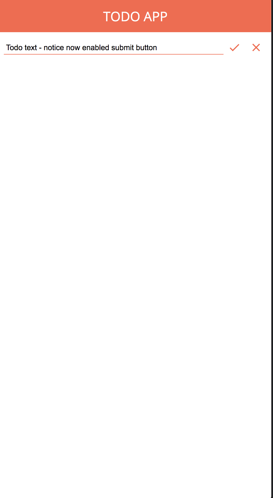

Once the form is submitted, the newly created TODO is added to the TODO list.

Desktop:
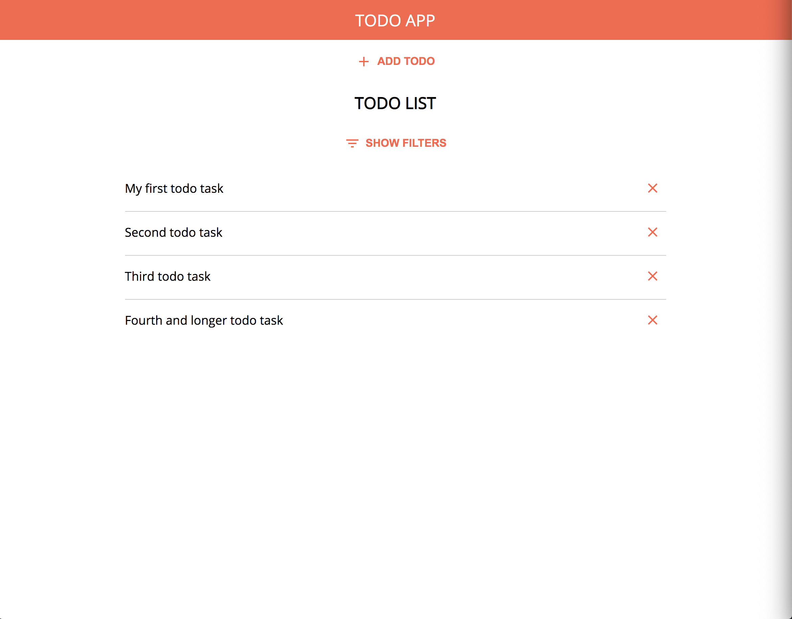

Mobile:
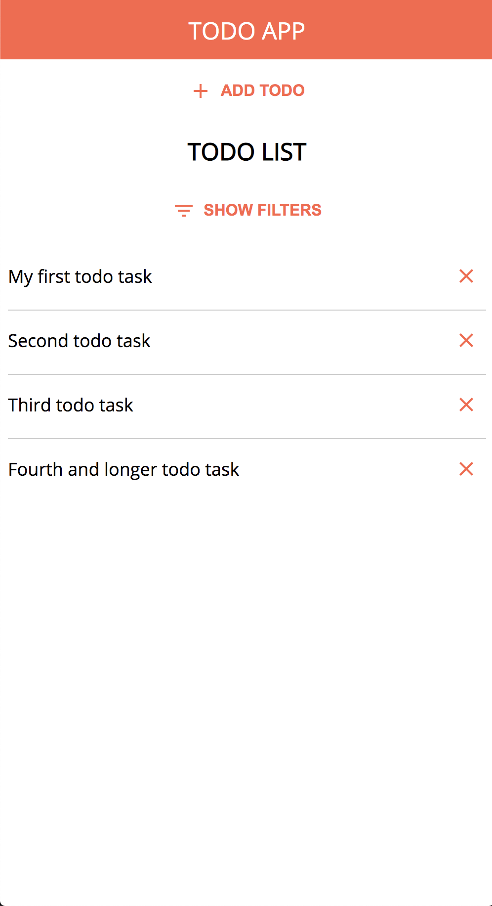

Users can click the SHOW FILTERS button which will show 3 additional buttons. Each button will show only todos matching its description (all, only completed, only non completed)

Desktop:
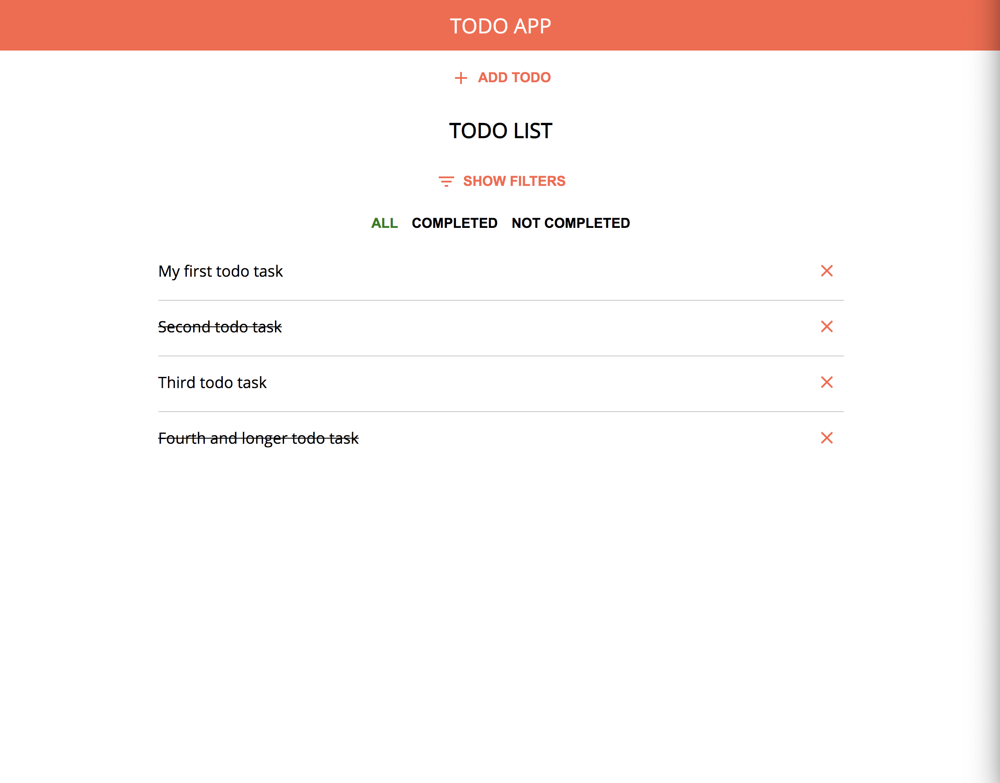

Mobile:
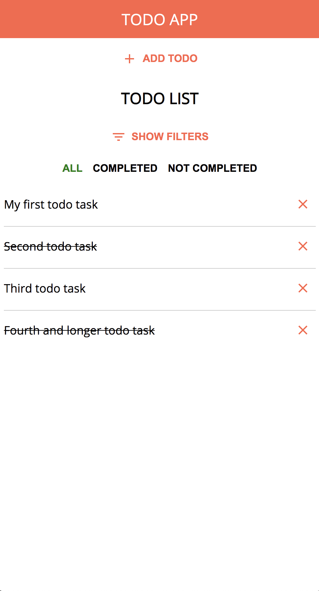

Layout with a Completed filter selected.

Desktop:
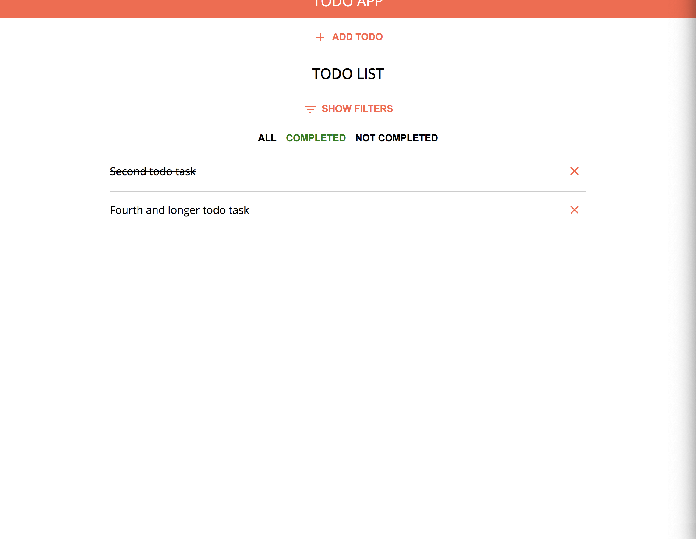

Mobile:
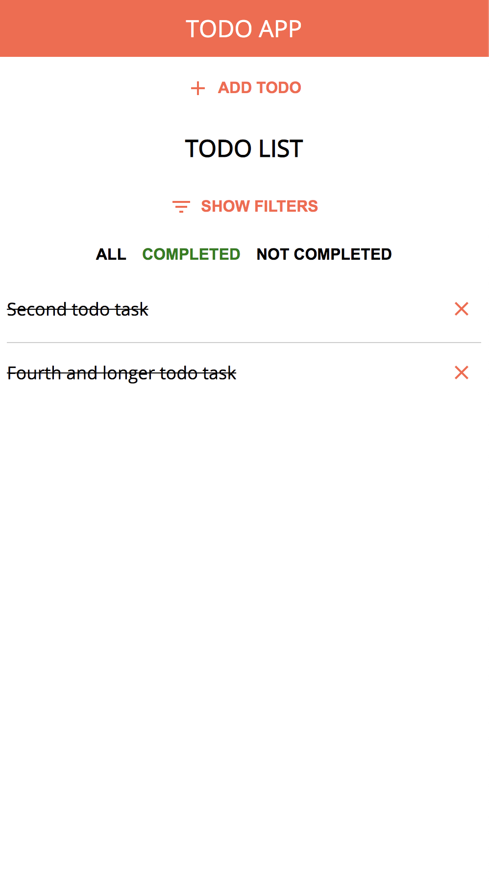

## Help

If you need help with homework feel free to contact me and we will clarify any confusion.
